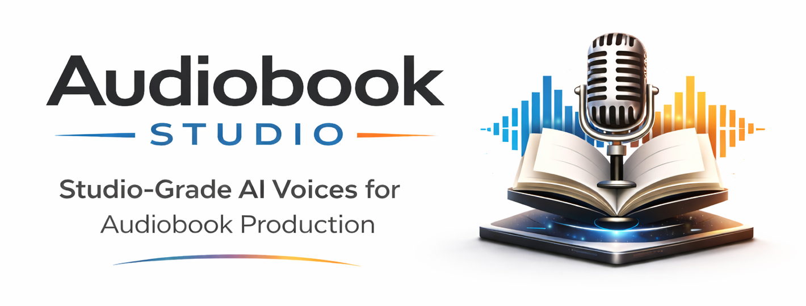
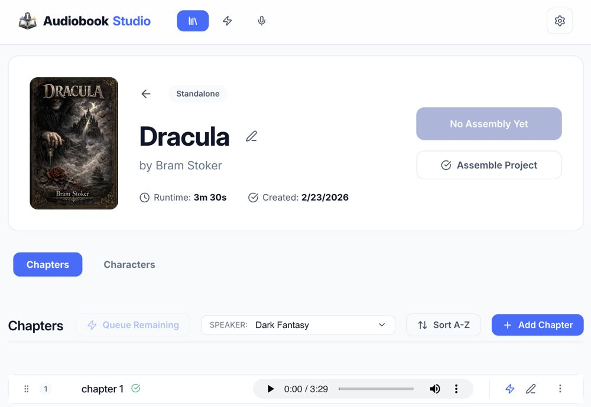
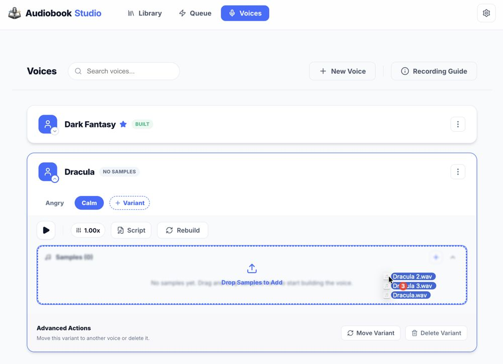
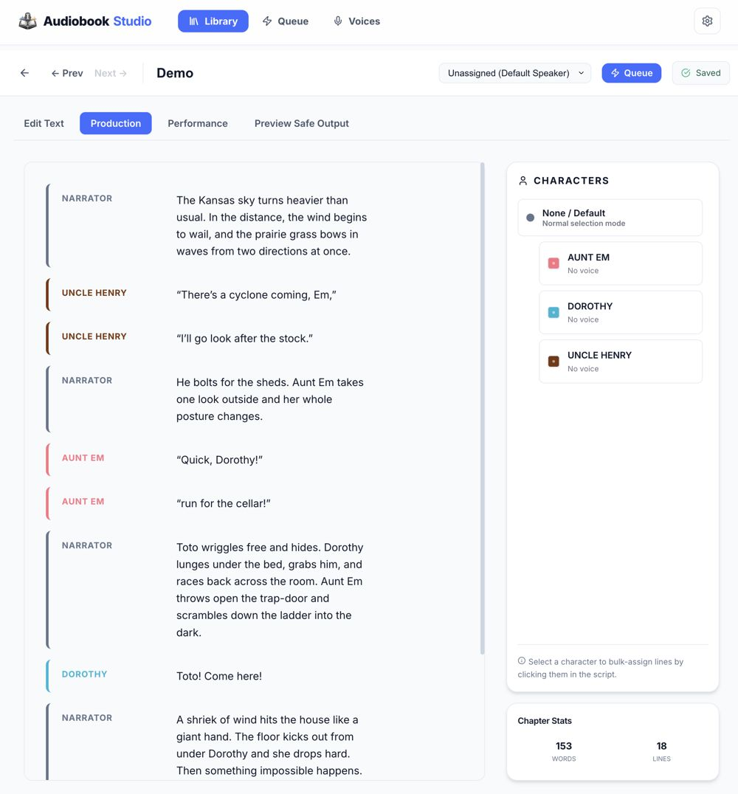
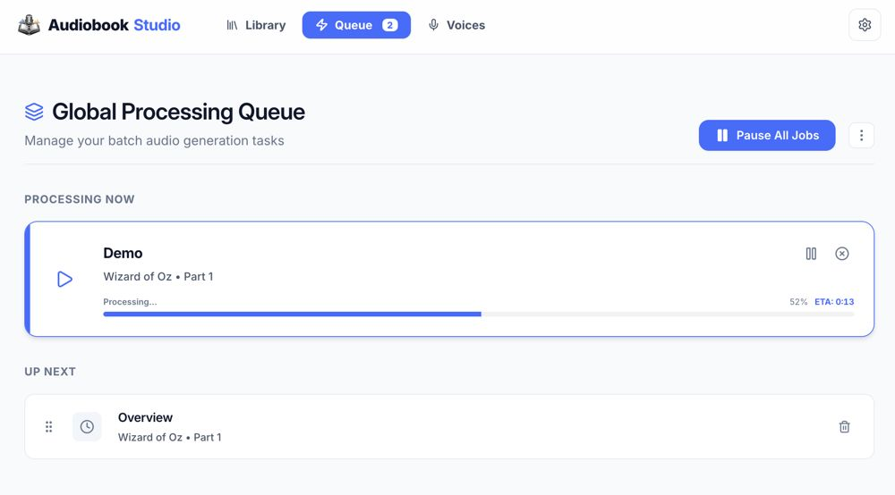

## Hear It In Action

Listen to the overview demo, explore the interface, and get a better feel for how Audiobook Studio sounds in practice.

[Open the Live Showcase](https://senigami.github.io/audiobook-studio/)

The live showcase also includes the fuller feature and cost comparison with ElevenLabs.

## Choose Your Start


Whether you want to preview the app, install it the easy way, or build from source, start with the path that fits your comfort level:

### Just want to see what it does?

**[Open the Live Demo / Showcase](https://senigami.github.io/audiobook-studio/)**  
Listen to real samples, see the interface, and get a quick feel for the workflow before installing anything.

### Want the easiest install?

**[Install Audiobook Studio with Pinokio](https://beta.pinokio.co/apps/github-com-senigami-audiobook-studio-pinokio)**  
Best for most people. Pinokio handles the setup for you and can optionally install a demo library with sample voices so you can explore the app right away.


### Want manual control or developer setup?

**[Install from Source on GitHub](https://github.com/senigami/audiobook-studio)**  
Best for developers or advanced users who want the full repo, direct scripts, and manual control over the environment.

### Need detailed help?

**[Read the Wiki / Getting Started Guide](https://github.com/senigami/audiobook-studio/wiki)**  
Step-by-step documentation, concepts, troubleshooting, and workflow guides.

# Audiobook Studio

### Local AI audiobook production with voice cloning, chapter repair, and long-form workflow control

[](https://github.com/senigami/audiobook-studio/actions)
[](https://opensource.org/licenses/MIT)
[](https://www.python.org/downloads/)
[](https://nodejs.org/)

**Audiobook Studio** is a local-first production app for turning manuscripts into polished audiobooks with AI voices you control.

It is built for real long-form work, not just one-click text-to-speech. You can assign voices to characters, repair individual segments, requeue partial chapters, build portable voice profiles, and assemble finished books without sending your manuscript or cloned voices to a paid cloud service.

XTTS remains the private local-default engine. Voxtral is available as an optional cloud voice engine after you add your own Mistral API key in Settings.

> [!IMPORTANT]
> **This is the current recommended release line for new users.**
> It keeps XTTS as the private local-default path, adds optional Voxtral support behind Settings, and includes the latest patch-line fixes for persisted voice defaults, clearer XTTS startup visibility, and post-1.8.0 workflow stability.

<details>
<summary>What's New In The Current Release</summary>
## What's New In The Current Release

- **Project and chapter voice choices now persist correctly**: Voice selections now save through the API, survive refreshes, and properly clear back to inherited defaults when you choose the default option again.
- **Default voice labels are clearer**: Default options now show the actual effective fallback voice in parentheses using the same display-name logic as the rest of the picker.
- **XTTS first-run setup is easier to understand**: Worker output now surfaces more Hugging Face and model-download progress so long first-run preparation looks like active work instead of a silent stall.
- **Patch-line stability work continues**: This release keeps the local-first XTTS path and optional Voxtral support while tightening the voice workflow and speeding up PR validation.

If you want the earlier patch-release details for chunking, playback, and Windows startup fixes, see the [changelog](https://github.com/senigami/audiobook-studio/wiki/Changelog).
</details>

## Why People Use It

- **Produce full audiobooks locally** with XTTS-based voice cloning and chapter assembly.
- **Fix only what changed** instead of regenerating an entire book every time one sentence sounds wrong.
- **Assign different voices to dialogue and narration** inside the same chapter.
- **Keep your data private** because manuscripts, voice samples, and outputs stay on your machine.
- **Avoid recurring usage costs** while still getting a workflow closer to professional narration tools.

## What Makes It Different

Most TTS tools stop at "paste text and generate audio."

Audiobook Studio is built around the messy reality of audiobook production:

- pronunciations need hand-tuning
- dialogue needs different voices
- chapters need partial rebuilds
- queueing and progress need to stay understandable
- finished books need real assembly and export

This project gives you a production surface for that work, not just a synthesis endpoint.

## Audiobook Studio vs. ElevenLabs

ElevenLabs is a strong product. It has polished voices, a fast cloud workflow, and useful Studio tools for multi-voice generation and paragraph-level regeneration.

Audiobook Studio is strongest in different places:

- **No recurring generation subscription**
- **Private, local-first workflow**
- **You own the manuscript, voices, and output**
- **Corrections do not keep charging you**

If you are building a real audiobook instead of a few test clips, those differences matter a lot.

| Category | Audiobook Studio | ElevenLabs Studio |
| --- | --- | --- |
| Cost over time | Free to run after setup, local hardware cost only | Subscription and credit based |
| Privacy | Local-first, files stay on your machine | Cloud workflow |
| Ownership | Local project files and local voice assets | Platform account workflow |
| Voice assignment | Character and segment based editing inside your project | Section, paragraph, and character assignment in Studio |
| Repair workflow | Local segment repair, partial chapter requeue, and production review | Paragraph or word regeneration in the cloud |
| Setup | More involved | Easier to start |
| Baseline polish | Good with careful samples and tuning | Usually stronger out of the box |

## Cost Comparison

Hosted voice generation can get expensive fast for full-length books, especially when you factor in corrections and custom voices.

<details>
<summary>Show Details</summary>

Using ElevenLabs public pricing and credit rules as of **March 24, 2026**:


- **Starter**: `$5/month` for `30k` credits
- **Creator**: `$22/month` for `100k` credits
- **Pro**: `$99/month` for `500k` credits
- **Scale**: `$330/month` for `2M` credits
- **Flash/Turbo models**: `1 text character = 0.5 credits`
- **Other models**: `1 text character = 1 credit`

For a fair comparison, this table uses a **600,000 character book** as a full-length example.

| Production type | Minimum realistic plan | Credit rule | Effective cost per 1,000 chars | Clean 600k-char pass | 600k chars with moderate corrections (1.5x) |
| --- | --- | --- | ---: | ---: | ---: |
| Standard single voice | Starter | `0.5 credits/char` | about `$0.08` | about `$50` in effective usage | about `$75` in effective usage |
| Custom cloned voice | Creator | `0.5 credits/char` | about `$0.11` | about `$66` in effective usage | about `$99` in effective usage |
| Higher-cost models | Creator | `1 credit/char` | about `$0.22` | about `$132` in effective usage | about `$198` in effective usage |

And this is what the **real-world monthly spend** often looks like when you actually need enough credits to finish the book in a normal production cycle:

| Scenario | Credits needed | Likely plan needed in practice | Monthly spend |
| --- | ---: | --- | ---: |
| 600k chars, Flash/Turbo clean pass | `300k` | Pro | `$99` |
| 600k chars, Flash/Turbo with moderate corrections | `450k` | Pro | `$99` |
| 600k chars, Flash/Turbo with heavy iteration | `600k` | Scale or multiple months | `$330` or multiple months |
| 600k chars, higher-cost model clean pass | `600k` | Scale or multiple months | `$330` or multiple months |
| 600k chars, higher-cost model with corrections | `900k` | Scale | `$330` |
</details>

That is where Audiobook Studio becomes especially compelling:

- you do not hesitate to fix a pronunciation
- you do not pay extra to test another take
- you can iterate freely without watching credits

If you want the longer written breakdown, see the wiki page: [Comparison and Cost](https://github.com/senigami/audiobook-studio/wiki/Comparison-and-Cost). If you want the more visual version, open the [Live Showcase](https://senigami.github.io/audiobook-studio/).

## Core Features

| Feature | What it enables |
| --- | --- |
| **Multi-voice production** | Assign speaker voices to characters, narration, or paragraph groups. |
| **Segment-level repair** | Regenerate only the lines that changed instead of redoing a whole chapter. |
| **Portable voice profiles** | Keep previews, latent cache, and voice profile assets together. |
| **Voice variants** | Build multiple styles of the same voice, such as `Default`, `Angry`, or `Calm`. |
| **Production queue** | Queue chapters, watch progress live, and recover cleanly from interruptions. |
| **Audiobook assembly** | Export finished chapter audio into long-form outputs with ffmpeg-based tooling. |
| **Optional cloud voices** | Keep XTTS fully local, or unlock Voxtral with your own Mistral API key when you want hosted TTS. |
| **Local-first privacy** | XTTS stays private by default; Voxtral remains explicit and opt-in. |

## What The Workflow Looks Like

1. Import or create a project.
2. Split the manuscript into chapters.
3. Build or import voice profiles.
4. Assign voices to narration and characters.
5. Generate chapters, inspect the performance view, and repair only the lines that need work.
6. Assemble the finished project into audiobook outputs.

If you want a fully local workflow, keep your voices on `XTTS (Local)`. If you want to try Voxtral, add a Mistral API key in Settings first and switch only the voices you want to `Voxtral (Cloud)`.

## Screenshots

| Project Workflow | Voice Lab |
| --- | --- |
|  |  |

| Chapter Production | Queue and Progress |
| --- | --- |
|  |  |

## Quick Start

### Requirements

- macOS, Linux, or Windows
- Python `3.10+`
- Node.js `18+`
- `ffmpeg`
- NVIDIA GPU recommended for faster local synthesis

## Installation Paths

There are two main ways to install Audiobook Studio:

- **Pinokio** for the easiest setup and launch experience
- **GitHub / scripts** for users who want direct manual control

If you are not comfortable with Git, virtual environments, or terminal commands, use **[Pinokio](https://beta.pinokio.co/apps/github-com-senigami-audiobook-studio-pinokio) first**.

### One-Command Setup and Run

This is the recommended developer path for new users.

On macOS or Linux, the easiest way to start is:

```bash
git clone https://github.com/senigami/audiobook-studio.git
cd audiobook-studio
./run.sh
```

On Windows PowerShell, use:

```powershell
git clone https://github.com/senigami/audiobook-studio.git
cd audiobook-studio
powershell -ExecutionPolicy Bypass -File .\run.ps1
```

The startup scripts will:

- create or update the main `venv`
- create or update the XTTS environment at `~/xtts-env`
- automatically recreate the XTTS environment if it detects stale legacy Coqui packages that would break voice builds
- install frontend dependencies if needed
- build the frontend if needed
- start the app on `http://127.0.0.1:8123`

If you are evaluating Audiobook Studio for the first time, this is the path to use. The separate manual backend/frontend flow is still documented below, but the launcher scripts are now the intended onboarding experience.

Useful options:

```bash
./run.sh --setup-only
./run.sh --no-reload
./run.sh --port 9000
```

```powershell
powershell -ExecutionPolicy Bypass -File .\run.ps1 -SetupOnly
powershell -ExecutionPolicy Bypass -File .\run.ps1 -NoReload
powershell -ExecutionPolicy Bypass -File .\run.ps1 -Port 9000
```

###Manual Install
<details>
<summary>Manual Install Steps</summary>

1. **Clone and Backend Setup**  
   Create the primary environment for the web server and project management.
   ```bash
   git clone https://github.com/senigami/audiobook-studio.git
   cd audiobook-studio

   python3 -m venv venv
   source venv/bin/activate
   pip install -r requirements.txt
   ```

2. **XTTS Inference Setup**  
   XTTS requires a separate environment to avoid dependency conflicts. The app expects this at `~/xtts-env` by default (configurable in `app/config.py`).
   ```bash
   python3 -m venv ~/xtts-env
   source ~/xtts-env/bin/activate
   pip install -r requirements-xtts.txt
   ```

3. **Frontend Build**  
   The UI must be built before it can be served by the backend.
   ```bash
   cd frontend
   npm install
   npm run build
   cd ..
   ```

### Run

You only need to activate the primary `venv` to start the server. The XTTS environment is managed automatically as a subprocess.

```bash
source venv/bin/activate
uvicorn run:app --port 8123
```

Then open [http://127.0.0.1:8123](http://127.0.0.1:8123).

</details>

> [!NOTE]
> On first run, the application creates the current app roots it needs immediately, including `projects/` and `voices/`. Other folders are created only when those features are used. On fresh installs, loose chapter text now defaults to `chapters/`. Older workspaces that already use `chapters_out/`, `xtts_audio/`, or `audiobooks/` still continue to work.
>
> **Git Protection**: These data directories and the local `state.json` file are now categorized and ignored by default in `.gitignore`. This keeps your production workspace, manuscript data, and cloned voice assets private during repository updates. If you have been manually tracking these folders and wish to continue doing so, you can force-track them with `git add --force` or manage exceptions in your local `.git/info/exclude`.

## Voice Profiles

Audiobook Studio supports reusable voice profiles across more than one engine.

- Add raw `.wav` samples to a voice profile
- Build a preview voice
- Create variants for different delivery styles
- Rebuild only when samples change
- Keep the voice profile and latent cache together for portability

Voice profiles now carry their own engine assignment:

- `XTTS (Local)` keeps generation on your machine
- `Voxtral (Cloud)` appears only after you add a Mistral API key in Settings
- mixed-engine chapters can use XTTS and Voxtral voices together when segments call for different profiles

Voice profiles can also now work as lightweight starter assets. A reusable profile can ship with:

- `profile.json`
- `latent.pth`
- an optional preview like `sample.mp3`

That means starter voices do not have to bundle every original training wav just to be usable.

The app now treats voice profiles as production assets, not throwaway cache entries.

## Long-Form Editing and Repair

This is where the app really shines.

- Edit chapter text and invalidate only the audio that should change
- Watch progress in the chapter view instead of getting thrown into a separate queue screen
- Resume partially-rendered work instead of starting from zero
- Rebuild completed chapters intentionally with confirmation
- Review paragraph groupings, playback, and character assignments inside the production workflow

## Privacy

Audiobook Studio is designed for **local-first production**.

Your manuscript, chapter text, voice samples, latent files, and rendered audio stay under your control on your own machine.

If you enable `Voxtral (Cloud)`, preview text, render text, and any selected reference audio for Voxtral requests are sent to Mistral for synthesis. That mode is optional and stays hidden unless you explicitly add your own API key.

## Release Notes and History

- [Changelog](https://github.com/senigami/audiobook-studio/wiki/Changelog)
- [Getting Started](https://github.com/senigami/audiobook-studio/wiki/Getting-Started)
- [Troubleshooting and FAQ](https://github.com/senigami/audiobook-studio/wiki/Troubleshooting-and-FAQ)

## Documentation

If you want the deeper walkthroughs, they are here:

- [Getting Started](https://github.com/senigami/audiobook-studio/wiki/Getting-Started)
- [Library and Projects](https://github.com/senigami/audiobook-studio/wiki/Library-and-Projects)
- [Voices and Voice Profiles](https://github.com/senigami/audiobook-studio/wiki/Voices-and-Voice-Profiles)
- [Queue and Jobs](https://github.com/senigami/audiobook-studio/wiki/Queue-and-Jobs)
- [Recording Guide](https://github.com/senigami/audiobook-studio/wiki/Recording-Guide)
- [Comparison and Cost](https://github.com/senigami/audiobook-studio/wiki/Comparison-and-Cost)
- [Troubleshooting and FAQ](https://github.com/senigami/audiobook-studio/wiki/Troubleshooting-and-FAQ)
- [Full Wiki](https://github.com/senigami/audiobook-studio/wiki)

## Showcase

If you want a quick visual walkthrough before installing:

- [Live Showcase](https://senigami.github.io/audiobook-studio/)

## Development

```bash
./venv/bin/python -m pytest -q
npm -C frontend run lint -- --ext .tsx,.ts
npm -C frontend run build
```

## License

Distributed under the **MIT License**. See [`LICENSE`](LICENSE) for more information.

---

<p align="center">
  <strong>Build audiobooks locally. Repair them like a studio. Keep your voices and manuscript under your control.</strong>
</p>
