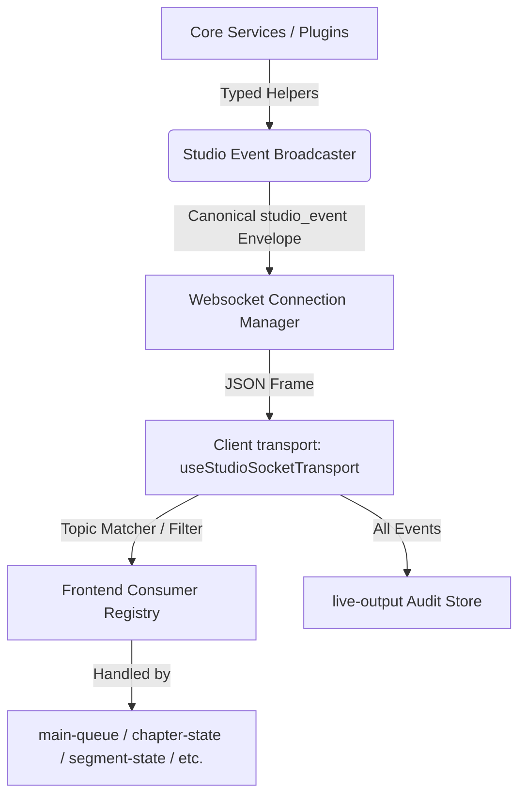

# Studio Event Broadcaster Contract

This document is the source of truth for the Studio Event Broadcaster contract refactor. It defines the unified backend event envelope, the strict core topics, the plugin-private namespace boundaries, the producer helper APIs, and the frontend consumer registry that will replace legacy websocket payloads.

---

## 1. Rationale: In-Process Broadcaster vs. External Broker

Studio is an interactive desktop/server application running as a single-host Python FastAPI server with background thread orchestration. 

### Why No External Broker?
1. **Zero Operational Overhead**: Introducing external message brokers like Redis, Kafka, RabbitMQ, or NATS would require users to install, configure, and maintain additional system daemons. This violates the self-contained desktop installation model of Audiobook Studio.
2. **Simplified Memory and Threading**: An in-process broadcaster leveraging Python's `asyncio.Queue` or callback registries is lightweight, resides entirely within the application's memory space, and incurs minimal resource overhead.
3. **No External Library Dependencies**: Introducing complex third-party event libraries (such as FastStream, PyPubSub, abxbus, etc.) adds dependency risk and maintenance debt. An explicit Python class utilizing FastAPI's existing WebSocket ConnectionManager matches Studio's modular style.
4. **Single Network Transport**: The browser-facing WebSocket remains the unified client transport. Clients do not need multiplexed connections; a single socket receives the serialized stream and routes it via the frontend's topic router.

---

## 2. Canonical `studio_event` Envelope

Every event transmitted over the WebSocket MUST be wrapped in the canonical `studio_event` envelope. This guarantees a uniform schema for metadata parsing, subscription matching, and audit tracking.

### Data Flow Diagram



### TypeScript Envelope Schema
```typescript
export interface StudioEventEnvelope<TTopic extends string = string, TPayload = unknown> {
  type: 'studio_event';
  version: 1;
  topic: TTopic;
  eventKind: string;
  source: string; // Emitter code module/function path
  emittedAt: number; // Unix epoch float
  pluginId: string | null; // Null if core app event
  ids: {
    projectId: string | null;
    chapterId: string | null;
    jobId: string | null;
    segmentId: string | null;
  };
  payload: TPayload;
}
```

### Python Types (Envelope)
```python
from typing import TypedDict, Literal, Optional

class StudioEventIds(TypedDict):
    projectId: Optional[str]
    chapterId: Optional[str]
    jobId: Optional[str]
    segmentId: Optional[str]

class StudioEventEnvelope(TypedDict):
    type: Literal["studio_event"]
    version: int  # Fixed at 1
    topic: str
    eventKind: str
    source: str
    emittedAt: float  # Unix timestamp
    pluginId: Optional[str]
    ids: StudioEventIds
    payload: dict
```

---

## 3. Strict Core App Topics & Payloads

Core topics define the stable communication channels for main application features. Their schemas are strictly typed and must not be bypassed or extended arbitrarily.

### 3.1 Topic: `queue.items`
* **Purpose**: Tracks the main queue item lifecycle, ordering, pause/resume state, and queue invalidation.
* **Producer API**: `events.queue_item_status`, `events.queue_item_invalidated`, `events.queue_paused`
* **Payload Fields**:
  ```typescript
  interface QueueItemsPayload {
    status: 'queued' | 'preparing' | 'running' | 'finalizing' | 'done' | 'failed' | 'cancelled';
    progress: number; // 0.0 to 1.0
    etaSeconds: number | null;
    message: string | null;
    reasonCode: string | null;
    classification: 'job' | 'chapter' | 'segment';
    changedFields: string[] | null;
  }
  ```

### 3.2 Topic: `chapters.lifecycle`
* **Purpose**: Forces durable chapter state invalidation (e.g., audio reset, text change, manual completion, generation trigger).
* **Producer API**: `events.chapter_lifecycle`
* **Payload Fields**:
  ```typescript
  interface ChapterLifecyclePayload {
    reason: string;
    changedFields: string[];
  }
  ```

### 3.3 Topic: `chapters.progress`
* **Purpose**: Emits chapter-level render progress, grouped progress, ETA, and terminal status. Feed main queue items for chapter-level renders.
* **Producer API**: `events.chapter_progress`
* **Payload Fields**:
  ```typescript
  interface ChapterProgressPayload {
    status: 'queued' | 'preparing' | 'running' | 'finalizing' | 'done' | 'failed' | 'cancelled';
    progress: number; // 0.0 to 1.0
    groupedProgress: number | null; // Grouped progress across batch
    etaSeconds: number | null;
    message: string | null;
    reasonCode: string | null;
    renderGroupCount: number | null;
    completedRenderGroups: number | null;
  }
  ```

### 3.4 Topic: `segments.lifecycle`
* **Purpose**: Notifies that the segment list or segment status has changed, requiring a data reload.
* **Producer API**: `events.segment_lifecycle`
* **Payload Fields**:
  ```typescript
  interface SegmentLifecyclePayload {
    reason: string;
    changedFields: string[];
  }
  ```

### 3.5 Topic: `segments.progress`
* **Purpose**: Active segment progress bar updates, start events, and segment save/done events.
* **Producer API**: `events.segment_progress`
* **Payload Fields**:
  ```typescript
  interface SegmentProgressPayload {
    status: 'preparing' | 'running' | 'processing' | 'finalizing' | 'done' | 'failed';
    progress: number; // 0.0 to 1.0
    segmentIndex: number | null;
    segmentCount: number | null;
    message: string | null;
    reasonCode: string | null;
  }
  ```

### 3.6 Topic: `tts.logs`
* **Purpose**: Diagnostic log lines from TTS engines/synthesis bridges.
* **Producer API**: `events.tts_log`
* **Payload Fields**:
  ```typescript
  interface TtsLogsPayload {
    line: string;
    level: 'DEBUG' | 'INFO' | 'WARNING' | 'ERROR';
    sequence: number;
    pluginId: string;
    jobId: string | null;
    chapterId: string | null;
    source: string;
  }
  ```

### 3.7 Topic: `voice.test`
* **Purpose**: Diagnostics and progress during voice tests, preview generation, and fine-tuning builds.
* **Producer API**: `events.voice_test_progress`
* **Payload Fields**:
  ```typescript
  interface VoiceTestPayload {
    voiceName: string;
    status: 'preparing' | 'running' | 'done' | 'failed';
    progress: number; // 0.0 to 1.0
    startedAt: number; // Unix timestamp
    message: string | null;
  }
  ```

### 3.8 Topic: `system.events`
* **Purpose**: Administrative, auditing, and system debug events that do not mutate application domain state.
* **Producer API**: General broadcaster direct calls
* **Payload Fields**:
  ```typescript
  interface SystemEventsPayload {
    eventKind: string;
    message: string;
    details: Record<string, unknown>;
  }
  ```

### 3.9 Topic: `projects.lifecycle`
* **Purpose**: Project-level lifecycles, configuration changes, metadata updates, and cache invalidation.
* **Producer API**: `events.project_lifecycle`
* **Payload Fields**:
  ```typescript
  interface ProjectLifecyclePayload {
    reason: string;
    changedFields: string[];
  }
  ```

---

## 4. Plugin-Private Namespaced Topics

To prevent engine-specific logic from leaking into core application code, plugins can emit namespaced events for their custom UI surfaces.

### 4.1 Namespace Convention
All plugin-private topics MUST use the following string hierarchy:
```
plugins.<plugin_id>.<area>
```
*Example*: `plugins.tts_xtts.diagnostics` or `plugins.voxtral.custom_cache`.

### 4.2 Flexibility Boundaries
* **Payload Flexibility**: The broadcaster accepts any JSON-serializable payload on plugin-private namespaces.
* **Zero Core Mutation**: Plugin-private events **must not** mutate core application stores (like Queue, Projects, Chapters, or Segments stores).
* **Isolation**: These events should only be consumed by custom plugin-owned panels, settings drawers, or dev pages.
* **Auditing**: All plugin-private events are recorded in the client's `liveEventAuditStore` and displayed on the `/event-stream` interface.

---

## 5. Backend Producer Helper APIs

The backend exposes a structured `events` module containing explicit helper functions. This ensures callers do not construct envelopes manually.

```python
# app/api/contracts/events.py

from typing import List, Optional
import time
import sys

def _resolve_source_path() -> str:
    """Helper to walk the stack and extract calling function namespace."""
    try:
        frame = sys._getframe(2)
        module = frame.f_globals.get("__name__", "")
        function = frame.f_code.co_name
        return f"{module}.{function}"
    except Exception:
        return "app.api.contracts.events"

def broadcast_studio_event(
    topic: str,
    event_kind: str,
    payload: dict,
    plugin_id: Optional[str] = None,
    project_id: Optional[str] = None,
    chapter_id: Optional[str] = None,
    job_id: Optional[str] = None,
    segment_id: Optional[str] = None,
) -> None:
    """Canonical broadcast function wrapping payload in studio_event envelope."""
    envelope = {
        "type": "studio_event",
        "version": 1,
        "topic": topic,
        "eventKind": event_kind,
        "source": _resolve_source_path(),
        "emittedAt": time.time(),
        "pluginId": plugin_id,
        "ids": {
            "projectId": project_id,
            "chapterId": chapter_id,
            "jobId": job_id,
            "segmentId": segment_id
        },
        "payload": payload
    }
    # Hand off to WebSocket connection manager for routing
    from app.api.ws import manager
    manager.broadcast(envelope)

# Typed Producer Helpers

def tts_log(
    line: str,
    level: str,
    sequence: int,
    plugin_id: str,
    job_id: Optional[str] = None,
    chapter_id: Optional[str] = None,
) -> None:
    """Plugins emit structured log lines directly instead of stdout scraping."""
    payload = {
        "line": line.rstrip("\n"),
        "level": level,
        "sequence": sequence,
        "pluginId": plugin_id,
        "jobId": job_id,
        "chapterId": chapter_id,
        "source": _resolve_source_path()
    }
    broadcast_studio_event(
        topic="tts.logs",
        event_kind="tts_log",
        payload=payload,
        plugin_id=plugin_id,
        chapter_id=chapter_id,
        job_id=job_id
    )

def queue_item_status(
    job_id: str,
    status: str,
    progress: float,
    eta_seconds: Optional[int] = None,
    message: Optional[str] = None,
    reason_code: Optional[str] = None,
    classification: str = "job",
) -> None:
    payload = {
        "status": status,
        "progress": round(progress, 2),
        "etaSeconds": eta_seconds,
        "message": message,
        "reasonCode": reason_code,
        "classification": classification,
        "changedFields": None
    }
    broadcast_studio_event(
        topic="queue.items",
        event_kind="queue_item_status",
        payload=payload,
        job_id=job_id
    )

def queue_item_invalidated(reason: str, changed_fields: List[str]) -> None:
    payload = {
        "reasonCode": reason,
        "changedFields": changed_fields
    }
    broadcast_studio_event(
        topic="queue.items",
        event_kind="queue_item_invalidated",
        payload=payload
    )

def queue_paused(paused: bool) -> None:
    payload = {
        "reasonCode": "queue_paused",
        "changedFields": ["paused"],
        "paused": paused
    }
    broadcast_studio_event(
        topic="queue.items",
        event_kind="queue_paused",
        payload=payload
    )

def chapter_progress(
    chapter_id: str,
    status: str,
    progress: float,
    grouped_progress: Optional[float] = None,
    eta_seconds: Optional[int] = None,
    message: Optional[str] = None,
    reason_code: Optional[str] = None,
    render_group_count: Optional[int] = None,
    completed_render_groups: Optional[int] = None,
) -> None:
    payload = {
        "status": status,
        "progress": round(progress, 2),
        "groupedProgress": round(grouped_progress, 2) if grouped_progress is not None else None,
        "etaSeconds": eta_seconds,
        "message": message,
        "reasonCode": reason_code,
        "renderGroupCount": render_group_count,
        "completedRenderGroups": completed_render_groups
    }
    broadcast_studio_event(
        topic="chapters.progress",
        event_kind="chapter_progress",
        payload=payload,
        chapter_id=chapter_id
    )

def segment_progress(
    segment_id: str,
    status: str,
    progress: float,
    segment_index: Optional[int] = None,
    segment_count: Optional[int] = None,
    message: Optional[str] = None,
    reason_code: Optional[str] = None,
) -> None:
    payload = {
        "status": status,
        "progress": round(progress, 2),
        "segmentIndex": segment_index,
        "segmentCount": segment_count,
        "message": message,
        "reasonCode": reason_code
    }
    broadcast_studio_event(
        topic="segments.progress",
        event_kind="segment_progress",
        payload=payload,
        segment_id=segment_id
    )

def segment_lifecycle(chapter_id: str, reason: str, changed_fields: List[str]) -> None:
    payload = {
        "reason": reason,
        "changedFields": changed_fields
    }
    broadcast_studio_event(
        topic="segments.lifecycle",
        event_kind="segment_lifecycle",
        payload=payload,
        chapter_id=chapter_id
    )

def chapter_lifecycle(chapter_id: str, reason: str, changed_fields: List[str]) -> None:
    payload = {
        "reason": reason,
        "changedFields": changed_fields
    }
    broadcast_studio_event(
        topic="chapters.lifecycle",
        event_kind="chapter_lifecycle",
        payload=payload,
        chapter_id=chapter_id
    )

def voice_test_progress(
    voice_name: str,
    status: str,
    progress: float,
    started_at: float,
    message: Optional[str] = None,
) -> None:
    payload = {
        "voiceName": voice_name,
        "status": status,
        "progress": round(progress, 2),
        "startedAt": started_at,
        "message": message
    }
    broadcast_studio_event(
        topic="voice.test",
        event_kind="voice_test_progress",
        payload=payload
    )

def plugin_event(
    plugin_id: str,
    area: str,
    event_kind: str,
    payload: dict,
    project_id: Optional[str] = None,
    chapter_id: Optional[str] = None,
    job_id: Optional[str] = None,
    segment_id: Optional[str] = None,
) -> None:
    """Emit namespaced, flexible custom plugin metrics or telemetry."""
    broadcast_studio_event(
        topic=f"plugins.{plugin_id}.{area}",
        event_kind=event_kind,
        payload=payload,
        plugin_id=plugin_id,
        project_id=project_id,
        chapter_id=chapter_id,
        job_id=job_id,
        segment_id=segment_id
    )
```

---

## 6. Frontend Consumer Registry (Surface Names)

The frontend maps incoming topics to logical consumer surfaces. The registry must use explicit surface names to decouple presentation surfaces from hook definitions.

### Registry Mapping Table

| Consumer Surface | Listened Topics | Target UI Components / States |
| :--- | :--- | :--- |
| **`main-queue`** | `queue.items`, `chapters.progress` | Queue manager state, Queue files overlays |
| **`chapter-state`** | `chapters.lifecycle`, `chapters.progress`, `segments.progress` | ChapterEditor workspace, chapter status badges |
| **`segment-state`** | `segments.lifecycle`, `segments.progress` | ChapterEditor script view, segment progress bars |
| **`project-state`** | `projects.lifecycle` | Project settings page, project dashboard state |
| **`tts-diagnostics`** | `tts.logs` | Settings -> Engine Diagnostics console panel |
| **`voice-test-state`** | `voice.test` | Voice management drawer, preview modals |
| **`plugin:<plugin_id>:<area>`** | `plugins.<plugin_id>.<area>` | Dedicated plugin UI components, custom metrics views |
| **`live-output`** | *All topics* | `/event-stream` audit timeline |

---

## 7. Live Output Display & Telemetry

The Live Output route `/event-stream` lists WebSocket frames to enable visual auditing.

### UI Columns & Layout
* **Time**: Local client receive time (`HH:MM:SS.mmm`).
* **Topic**: Topic hierarchy (e.g., `queue.items`).
* **Category**: Derived classification for readability (e.g., `Queue`, `Chapter`, `Segment`, `Log`, `Voice`, `Plugin`).
* **Event**: Envelope `eventKind` (e.g., `queue_item_status`).
* **Handled by**: Telemetry list of matched consumer surfaces (e.g., `main-queue, chapter-state`). Derived by running the consumer registry matches.
* **Job / Chapter / Segment**: Entity IDs displayed if present in the `ids` object.
* **Message**: Display representation of payload text (e.g., diagnostic log lines, progress status messages).

### Filter Controls
Provide toggles at the top of the timeline:
* **All**: Default showing everything.
* **Main Queue**: Shows only events matched by `main-queue` consumer.
* **Chapter State**: Shows only events matched by `chapter-state`.
* **Segment State**: Shows only events matched by `segment-state`.
* **TTS Logs**: Shows only events matched by `tts-diagnostics`.
* **Plugin Private**: Shows topics matching `plugins.*`.

---

## 8. Migration Steps (Strangler Pattern)

To avoid breaking existing websocket features during cutover, we will execute a staged rollout.

### Phase 1: Dual Broadcast & Frontend Normalization
1. **Backend Integration**: 
   * Modify the legacy emitters (e.g., `broadcast_job_updated`) to broadcast both the legacy JSON format and the new `studio_event` envelope format.
   * Add the new `events` helpers. Callers can progressively migrate to calling `events.tts_log()` or `events.queue_item_status()` instead of old-style constructs.
2. **Frontend Adaptation**:
   * Update the frontend normalizer (`normalizeStudioSocketEnvelope` in `frontend/src/api/contracts/liveEvents.ts`) to accept the new `studio_event` envelope.
   * For any incoming frame that does *not* contain the `studio_event` envelope, run client-side transformation to map the legacy payload fields into a temporary `studio_event` envelope structure. This shields consumer surfaces from raw legacy payloads.

### Phase 2: Complete Cutover
1. **Backend Cleanup**:
   * Migrate remaining backend references to only emit through the new `events` module functions.
   * Remove legacy formatting handlers (`build_studio_job_event`, `build_tts_log_line_event`) and legacy broadcast methods from `app/api/ws.py`.
2. **Frontend Finalization**:
   * Clean up the client-side legacy-to-canonical normalizer code.
   * Make receiving a non-`studio_event` envelope trigger a `system.events` warning.

---

## 9. Verification & Test Plan

### Backend Tests
* **Envelope Validation**: Test that any payload emitted matches `StudioEventEnvelope` structure (validate with unit test schemas).
* **Helper Isolation**: Test that calling `events.plugin_event` broadcasts to `plugins.<plugin_id>.<area>` and does not trigger side-effects on core tables.
* **Source Resolution**: Verify that the stack frames helper (`_resolve_source_path`) correctly extracts calling function names in the envelope.

### Frontend Tests
* **Normalizer Assertions**: Write unit tests in `liveEvents.test.ts` to assert that:
  - Canonical `studio_event` inputs pass through unaltered.
  - Legacy payloads (e.g., `type: "tts_log_line"`, `type: "queue_updated"`) map cleanly to target envelopes.
* **Registry Matching**: Assert that `LIVE_EVENT_CONSUMERS` maps the correct topics to the designated consumer surfaces (`main-queue`, `chapter-state`, etc.).
* **Telemetry Verification**: Test that `/event-stream` renders the correct "Handled by" telemetry arrays depending on which registry items match the event's topic.

### Execution Command Baseline
```bash
# Backend pytest suite
./venv/bin/python -m pytest tests/test_websocket_broadcast.py

# Frontend Vitest suite
cd frontend && /opt/homebrew/bin/npx vitest run tests/unit/store/studioSocketBus.test.ts tests/unit/pages/LiveOutput/LiveOutputPage.test.tsx
```

---

## 10. Studio Event Lifecycle Audit Matrix

| Lifecycle Step | Producer | Durable State Write | Topic | eventKind | Required IDs | Payload Fields |
| :--- | :--- | :--- | :--- | :--- | :--- | :--- |
| **Browser enqueue** | `processing_queue.py` / `TaskOrchestrator.submit` | `put_job()` writes `status: "queued"`, `progress: 0.0` | `queue.items` | `queue_item_status` | `projectId`, `chapterId`, `jobId` | `status: "queued"`, `progress: 0.0`, `etaSeconds: null`, `classification: "chapter" \| "segment"` |
| **Processor pickup** | `TaskOrchestrator._publish` / `ProgressService.publish` | `update_job()` writes `status: "preparing"` | `queue.items` / `chapters.progress` | `queue_item_status` / `chapter_progress` | `projectId`, `chapterId`, `jobId` | `status: "preparing"`, `progress: 0.0`, `etaSeconds: null`, `classification: "chapter"` |
| **Plugin receipt/ack** | `TaskOrchestrator._publish` / `ProgressService.publish` | `update_job()` writes `status: "running"` | `chapters.progress` | `chapter_progress` | `projectId`, `chapterId`, `jobId` | `status: "running"`, `progress: 0.0` \| prev, `etaSeconds: ...` |
| **Segment render start** | `TaskOrchestrator._publish` (triggered by log parser) | `update_job()` writes `active_segment_id`, `active_segment_progress: 0.0` | `segments.progress` | `segment_progress` | `projectId`, `chapterId`, `jobId`, `segmentId` | `status: "running"`, `progress: 0.0`, `segmentIndex: ...`, `segmentCount: ...` |
| **Chapter render progress** | `TaskOrchestrator._publish` / `ProgressService.publish` | `update_job()` writes overall `progress`, `grouped_progress` | `chapters.progress` | `chapter_progress` | `projectId`, `chapterId`, `jobId` | `status: "running"`, `progress: ...`, `groupedProgress: ...`, `etaSeconds: ...`, `renderGroupCount: ...`, `completedRenderGroups: ...` |
| **Segment render progress** | `TaskOrchestrator._publish` / `ProgressService.publish` | `update_job()` writes `active_segment_progress` | `segments.progress` | `segment_progress` | `projectId`, `chapterId`, `jobId`, `segmentId` | `status: "running"`, `progress: ...`, `segmentIndex: ...`, `segmentCount: ...` |
| **Segment completion** | `TaskOrchestrator._publish` (triggered by log parser) | `update_segment()` writes `audio_status: "done"`, `audio_file_path: ...` | `segments.progress` / `segments.lifecycle` | `segment_progress` / `segment_lifecycle` | `projectId`, `chapterId`, `jobId`, `segmentId` | `status: "done"`, `progress: 1.0` (for segments.progress) \| `reason: "saved"`, `changedFields: ["audio_status", ...]` (for segments.lifecycle) |
| **Chapter/job completion** | `TaskOrchestrator._publish` / `ProgressService.publish` | `update_job()` writes `status: "done"`, `progress: 1.0`, `finished_at` | `chapters.progress` / `queue.items` | `chapter_progress` / `queue_item_status` | `projectId`, `chapterId`, `jobId` | `status: "done"`, `progress: 1.0` (for both) |
| **Queue invalidation** | `state_jobs.py` / `broadcast_queue_update` | None | `queue.items` | `queue_item_invalidated` | `projectId` \| None, `jobId` \| None | `reasonCode: ...`, `changedFields: [...]` |
| **Queue pause status** | `ws.py` / `broadcast_pause_state` | None | `queue.items` | `queue_paused` | None | `reasonCode: "queue_paused"`, `changedFields: ["paused"]`, `paused: ...` |
| **TTS logs** | `broadcast_tts_log_line` | None (watchdog log buffer updated in-memory) | `tts.logs` | `tts_log` | `projectId`, `chapterId`, `jobId` | `line: ...`, `level: "INFO"`, `sequence: ...`, `pluginId: ...`, `pluginShortName: ...` |
