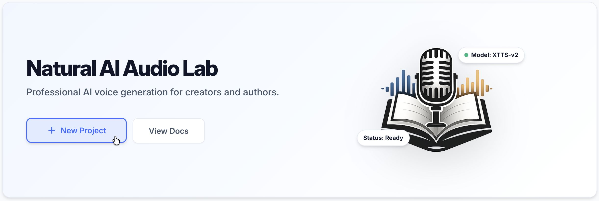

# Getting Started

This guide will walk you through setting up **Audiobook Studio** and creating your first project.

## 📋 Prerequisites

- **Python 3.11+**
- **Node.js 18+**
- **FFmpeg** (required for audio processing and stitching)
- **XTTS environment** (the provided startup script will create this at `~/xtts-env`)

## 🚀 Installation

### Fastest Start (macOS/Linux)

```bash
git clone https://github.com/senigami/audiobook-studio.git
cd audiobook-studio
./run.sh
```

This script will:

- create or update the main Python environment
- create or update the XTTS environment
- install frontend dependencies
- build the frontend
- start the app on `http://127.0.0.1:8123`

If you only want to prepare the environments and not start the server yet:

```bash
./run.sh --setup-only
```

### Manual Setup

If you prefer to install everything yourself, or if you are on Windows, use the manual path.

```bash
# Backend
python3.11 -m venv venv
source venv/bin/activate
pip install -r requirements.txt

# XTTS
python3.11 -m venv ~/xtts-env
source ~/xtts-env/bin/activate
pip install -r requirements-xtts.txt

# Frontend
cd frontend
npm install
npm run build
cd ..
```

## 🏃 Running the Application

### Start the App

```bash
source venv/bin/activate
uvicorn run:app --port 8123
```

Then open `http://127.0.0.1:8123`.

## 📖 Your First Project

1. **Navigate to Library**: This is the default screen.
2. **Create Project**: Click the "New Project" button.
3. **Fill Details**: Enter a name (e.g., "My First Audiobook") and upload a cover if you have one.
4. **Enter Project**: Click on the project card to enter the **Project View**.



---

[[Home]] | [[Concepts]] | [[Library and Projects]]
