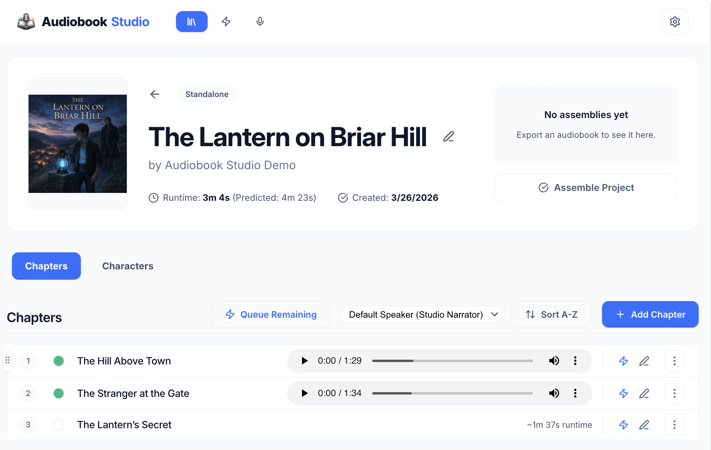
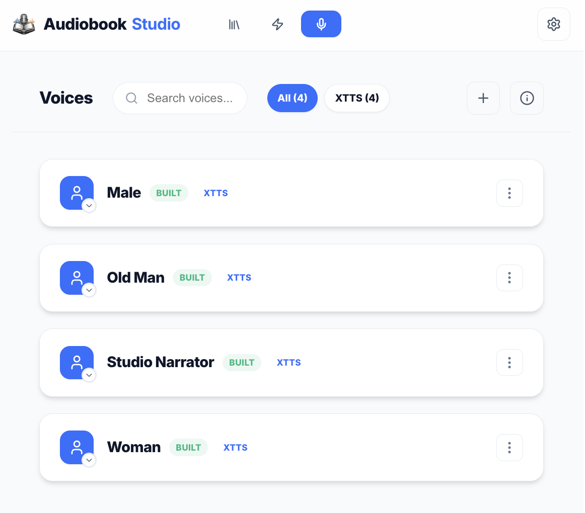

# Getting Started

This guide covers the current recommended first-run path for **Audiobook Studio**.

## Best Starting Point

If you are new to the project, start with the current `1.8.x` release line or the latest `main` after that release. Earlier versions contain important groundwork, but this is the first release family intended to feel smooth for brand-new users end to end across local XTTS production and optional Voxtral support.

## Requirements

- **Python 3.10+**
- **Node.js 18+**
- **FFmpeg**
- macOS, Linux, or Windows
- NVIDIA GPU recommended for faster local synthesis

## Recommended Setup

### macOS / Linux

```bash
git clone https://github.com/senigami/audiobook-studio.git
cd audiobook-studio
./run.sh
```

### Windows PowerShell

```powershell
git clone https://github.com/senigami/audiobook-studio.git
cd audiobook-studio
powershell -ExecutionPolicy Bypass -File .\run.ps1
```

The launcher scripts will:

- create or update the main `venv`
- create or update the XTTS environment at `~/xtts-env`
- repair stale XTTS environments if older conflicting Coqui packages are detected
- install frontend dependencies if needed
- build the frontend if needed
- start the app on `http://127.0.0.1:8123`

Useful options:

### macOS / Linux

```bash
./run.sh --setup-only
./run.sh --no-reload
./run.sh --port 9000
```

### Windows PowerShell

```powershell
powershell -ExecutionPolicy Bypass -File .\run.ps1 -SetupOnly
powershell -ExecutionPolicy Bypass -File .\run.ps1 -NoReload
powershell -ExecutionPolicy Bypass -File .\run.ps1 -Port 9000
```

## First Run

1. Launch the app with `./run.sh` or `run.ps1`.
2. Open `http://127.0.0.1:8123`.
3. Create a project from the Library.
4. Add or import chapter text.
5. Build or import a voice profile.
6. Assign narration and dialogue voices.
7. If you want cloud synthesis, add your own Mistral API key in Settings to unlock `Voxtral (Cloud)`.
7. Generate segments or queue a chapter.
8. Assemble the finished audiobook once chapter audio is ready.

## Exploring the Demo Library

If you installed Audiobook Studio via Pinokio and chose to include the **optional demo library**, you will be able to explore an almost-finished production immediately after opening the application. This gives an excellent overview of the completed workflow.

**1. The Demo Project**  
Immediately after installation, the Demo Project will appear in your Library home page. This allows you to dive straight into a working layout.


**2. Inside the Chapters Tab**  
Click into the demo project to see what chapters look like. While it intentionally skips the full text here, it lists the chapters and allows you to instantly listen, queue audio generation, or build the entire audiobook to M4B directly from this view.



**3. Included Voice Profiles**  
Under the Voices tab, you will find the bundled voices included with the demo project. You do not need to hunt for voice samples; these voices are pre-configured and can be dropped straight into any other project you create moving forward!



## Starter Voices

Audiobook Studio now supports lighter starter voice bundles.

A practical starter voice folder can contain:

- `profile.json`
- `latent.pth`
- optional `sample.mp3`

This allows a voice to remain usable for preview and generation without shipping every original source wav in the repository.

## XTTS And Voxtral

- `XTTS (Local)` is still the default local-first workflow.
- `Voxtral (Cloud)` stays hidden unless you add your own Mistral API key in Settings.
- Voices now store their engine per profile, so one chapter can mix XTTS narration and Voxtral character or narrator sections when needed.

## Manual Install

If you need a manual path instead of the launcher script, follow the root `README.md`. The launcher scripts are now the preferred onboarding flow and should be considered the default setup path for new users.

---

[[Home]] | [[Concepts]] | [[Library and Projects]]
