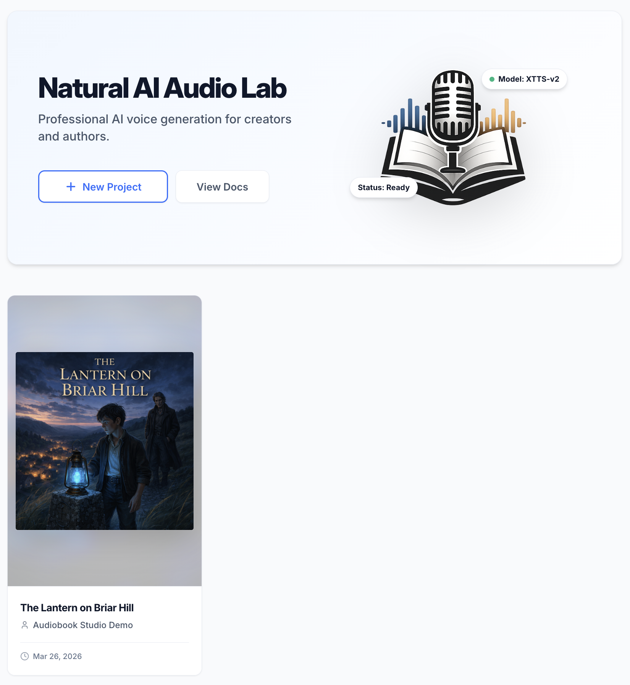
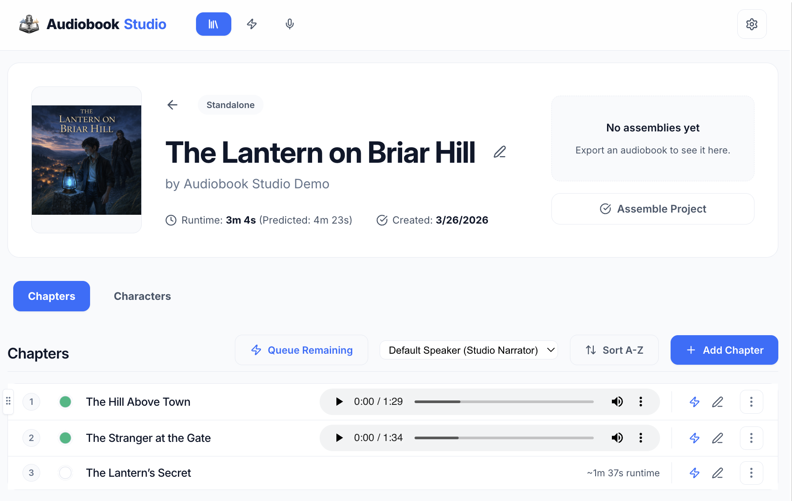
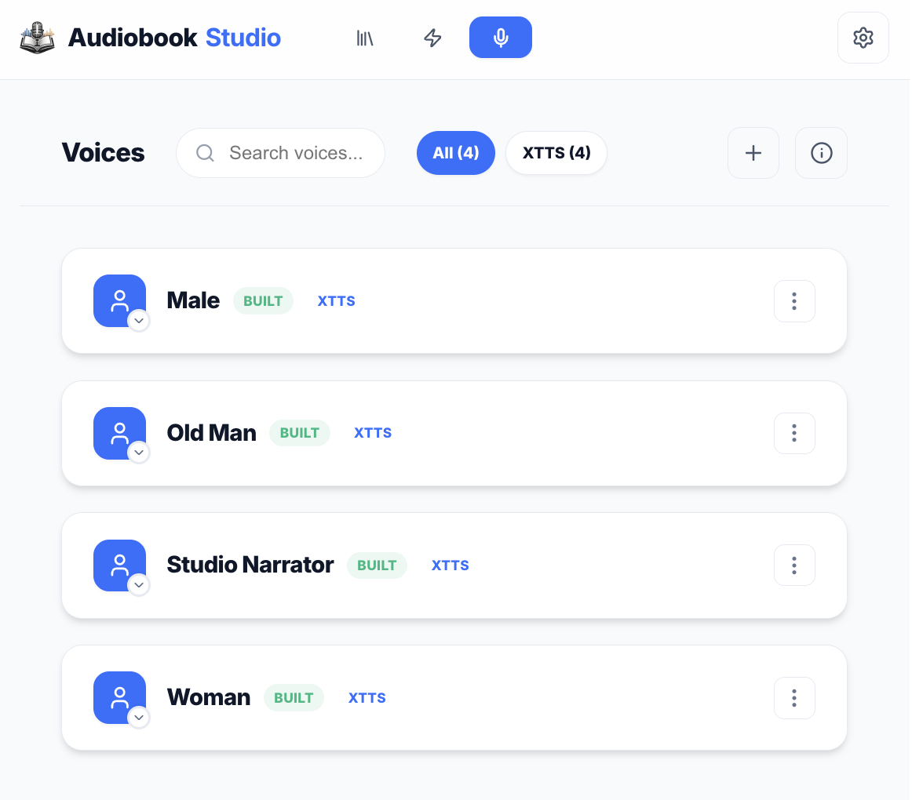

# Getting Started

This guide covers the current recommended first-run path for **Audiobook Studio**.

## Best Starting Point

If you are new to the project, start with the current Studio 2.0 release line or the latest `main` after that release. Studio 2.0 is the plugin-based release family for local XTTS production, optional Voxtral support, mixed rendering, and schema-driven engine settings.

## Requirements

- **Python 3.11+**
- **Node.js 18+**
- **FFmpeg**
- macOS, Linux, or Windows
- NVIDIA GPU recommended for faster local synthesis

## Recommended Setup

### macOS / Linux

```bash
git clone https://github.com/senigami/audiobook-studio.git
cd audiobook-studio
./run.sh
```

### Windows PowerShell

```powershell
git clone https://github.com/senigami/audiobook-studio.git
cd audiobook-studio
powershell -ExecutionPolicy Bypass -File .\run.ps1
```

The launcher scripts will:

- create or update the main `venv`
- create or update the engine environments (default: `~/xtts-env`)
- automatically repair stale environments if legacy package conflicts are detected
- install frontend dependencies if needed
- build the frontend if needed
- start the app on `http://127.0.0.1:8123`

Useful options:

### macOS / Linux

```bash
./run.sh --setup-only
./run.sh --no-reload
./run.sh --port 9000
```

### Windows PowerShell

```powershell
powershell -ExecutionPolicy Bypass -File .\run.ps1 -SetupOnly
powershell -ExecutionPolicy Bypass -File .\run.ps1 -NoReload
powershell -ExecutionPolicy Bypass -File .\run.ps1 -Port 9000
```

## First Run

1. Launch the app with `./run.sh` or `run.ps1`.
2. Open `http://127.0.0.1:8123`.
3. Create a project from the Library.
4. Add or import chapter text.
5. Build or import a voice profile.
6. Assign narration and dialogue voices.
7. If you want cloud synthesis, add your own Mistral API key in Settings to unlock `Voxtral (Cloud)`.
7. Generate segments or queue a chapter.
8. Assemble the finished audiobook once chapter audio is ready.

## Exploring the Demo Library

On any fresh install where `projects/` and `voices/` are both empty, the launcher (`run.sh` / `run.ps1`) automatically restores demo content from `demo/demo.zip`. This happens regardless of how you installed Studio — via Pinokio, the launcher scripts, or a manual setup. The path to the zip is overridable via the `AUDIOBOOK_STUDIO_DEMO_ZIP` environment variable if you want to supply your own demo package.

**1. The Demo Project**  
After a fresh install, the Demo Project appears in your Library home page, giving you a working layout to explore immediately.



**2. Inside the Chapters Tab**  
Click into the demo project to see what chapters look like. It lists the chapters and lets you listen, queue audio generation, or build the entire audiobook to M4B from this view.



**3. Included Voice Profiles**  
Under the Voices tab you will find the bundled voices included with the demo project. These are pre-configured and can be used in any other project you create.



## Starter Voices

Audiobook Studio now supports lighter starter voice bundles.

A practical starter voice folder can contain:

- `profile.json`
- `latent.pth`
- optional `sample.mp3`

This allows a voice to remain usable for preview and generation without shipping every original source WAV in the repository.

## XTTS And Voxtral

- `XTTS (Local)` is still the default local-first workflow.
- `Voxtral (Cloud)` stays hidden unless you add your own Mistral API key in Settings.
- Voices now store their engine per profile, so one chapter can mix XTTS narration and Voxtral character or narrator sections when needed.

## Manual Install

If you need a manual path instead of the launcher script, follow the root `README.md`. The launcher scripts are now the preferred onboarding flow and should be considered the default setup path for new users.

---

[[Home]] | [[Concepts]] | [[Library and Projects]]
