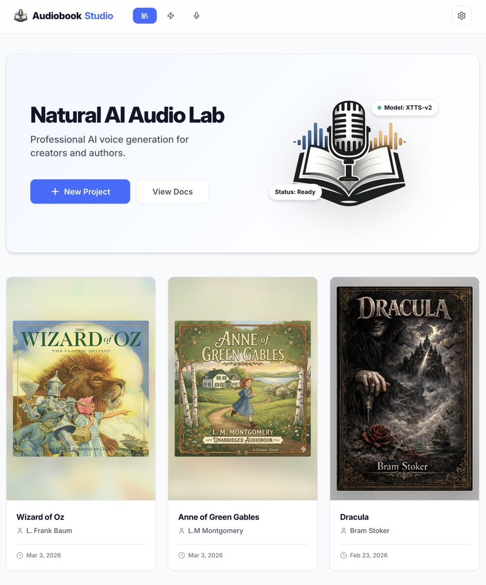

# Audiobook Studio Wiki

Welcome to the Audiobook Studio internal documentation. This Wiki is designed to help you understand the concepts, workflows, and technical details of the application.

## 📖 Quick Links

- [[Getting Started]] - Installation and first run.
- [[Concepts]] - Core architecture and terminology.
- [[Library and Projects]] - Managing your books.
- [[Voices and Voice Profiles]] - AI Voice Lab guide.
- [[Queue and Jobs]] - Monitoring generation.
- [[Recording Guide]] - Best practices for clean audio.
- [[Troubleshooting and FAQ]] - Solutions to common issues.

## ⚡ 5-Minute Quick Start

1. **Launch the App**: Run the backend and frontend. Open `localhost:5173`.
2. **Create a Project**: Go to the **Library** and click **+ New Project**. Enter the title and author.
3. **Add a Chapter**: Inside your project, click **+ Add Chapter**. Paste your text or upload a `.txt` file.
4. **Assign Voices**: In the **Performance** tab, highlight text segments and assign a character or narrator.
5. **Generate Audio**: Click **Queue All** or **Generate** on specific segments. Monitor progress in the **Queue** sidebar.
6. **Bake & Export**: Once all segments are 'Done', click **Bake Chapter**. Finally, go to the project level and click **Assemble Audiobook** to get your `.m4b` file.

## 🛠️ Local Preview

To preview these docs locally before pushing to GitHub:

1. Open this folder in VS Code.
2. Open `Home.md`.
3. Press `Cmd+Shift+V` (Mac) or `Ctrl+Shift+V` (Windows) to open the Markdown Preview.

---

[[Concepts]] | [[Getting Started]] | [[Voices and Voice Profiles]]
