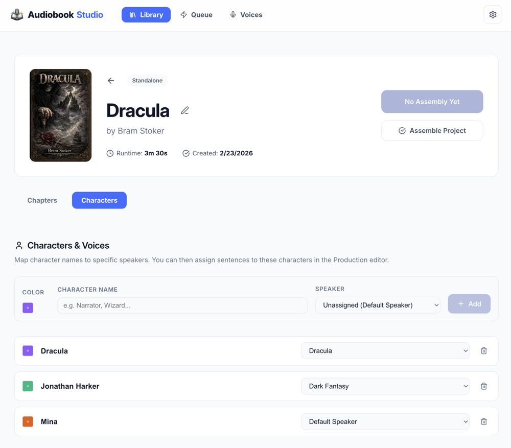

# Library and Projects

The Library is your control center for all audiobooks in progress.

## 📚 Managing the Library

- **Browse**: View all projects as cards.
- **New Project**: Use the floating "+" button to start a new book.
- **Delete**: Projects can be removed via the context menu on the project card. _Warning: This removes all associated audio and text._

## 📂 Project View

Once you open a project, you'll see several tabs:

### 1. Chapters Tab

This is where you manage the structure of your book.

- **Add Chapter**: Upload a `.txt` file or paste text directly.
- **Reorder**: Drag and drop chapters to change their sequence.
- **Metadata**: Click the settings icon to change title, author, or the book's cover.
- **Assemble Audiobook**: Located at the top right of the Project View.

#### Status Indicators (Status Orb)

Each chapter features a **Status Orb** that provides instant visual feedback and common actions:

- **Green**: Synthesis complete and in sync with the script.
- **Yellow Triangle**: "Out of Sync" — changes have been made to the script or voice assignments since the last render.
- **Empty / Grey Arc**: Shows percentage completion for chapters that have only been partially rendered.
- **Spinner**: Indicates a job is currently in progress.

**Pro Tip**: Click any non-rendering Orb to access a contextual action menu (e.g., "Queue rebuild", "Queue remaining").

### 2. Characters Tab

Manage the personas within your project.

- **Assign Profiles**: Link a project character to a Voice Variant from the AI Voice Lab.
- **Bulk Actions**: Select multiple segments to generate audio or change voices at once.

## 📝 Chapter Editor

Clicking a chapter opens the **Chapter Editor**, which has four primary workflows:

1. **Edit**: Raw text entry and cleanup.
2. **Production**: Quick voice assignment by highlighting text.
3. **Performance**: Granular segment management, playback, and per-segment generation.
4. **Preview**: See how the text will be partitioned by the engine.

## 🖼️ Covers and Metadata

- **Cover Art**: Recommended resolution is 1000x1000 pixels.
- **Author/Series**: Used during the final **Assembly** phase to tag the `.m4b` file.

---

[[Home]] | [[Queue and Jobs]] | [[Voices and Voice Profiles]]
