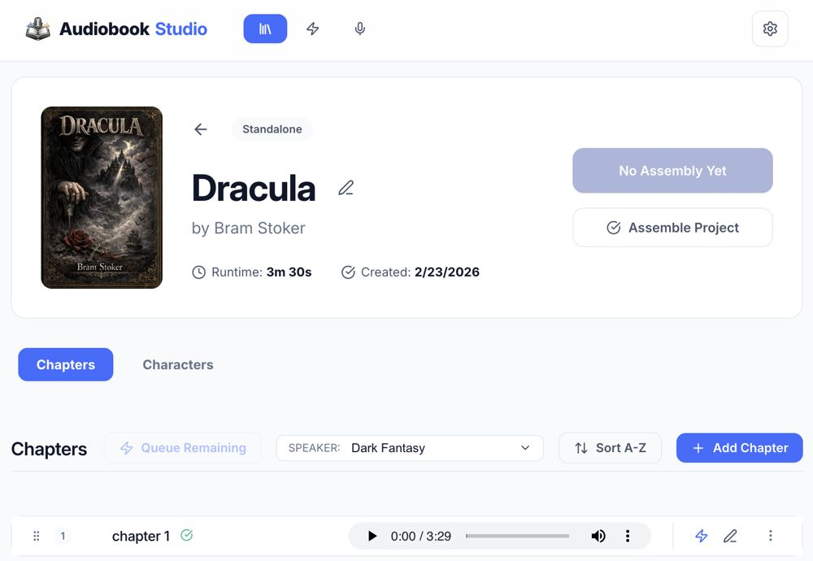
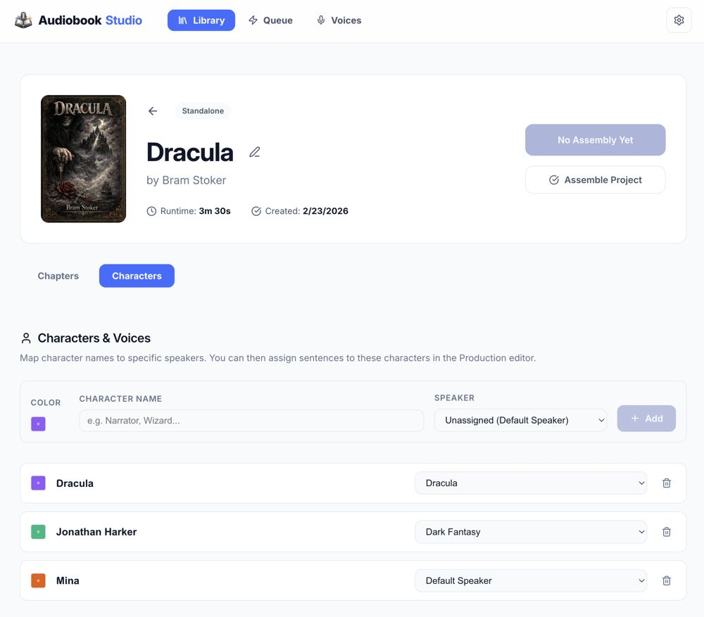
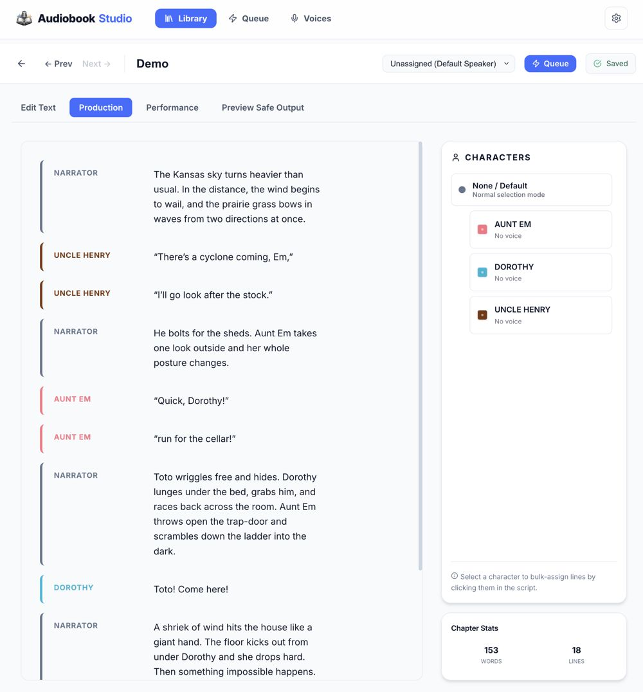

# Library and Projects

The Library is your control center for all audiobooks in progress.

## 📚 Managing the Library

- **Browse**: View all projects as cards or in list view.
- **Sort**: Use the Library controls to sort projects by the current project metadata instead of hunting through cards manually.
- **New Project**: Use the floating "+" button to start a new book.
- **Delete**: Projects can be removed via the context menu on the project card. _Warning: This removes all associated audio and text._

## 📂 Project View

Once you open a project, you'll see several tabs:

### 1. Chapters Tab

This is where you manage the structure of your book.

- **Add Chapter**: Upload a `.txt` file or paste text directly.
- **Reorder**: Drag and drop chapters to change their sequence.
- **Metadata**: Click the settings icon to change title, author, or the book's cover.
- **Assemble Audiobook**: Located at the top right of the Project View.

#### Status Indicators (Status Orb)

Each chapter features a **Status Orb** that provides instant visual feedback and common actions. The orb is now a cohesive widget with integrated indicators:

- **Central Fill**: Shows the state of the master WAV (Green = Success, Orange = Out of Sync, Spinner = Rendering).
- **Integrated Arcs**: Two subtle arcs on the outer ring show the availability of distribution formats:
  - **Top-Left Arc**: M4A availability.
  - **Top-Right Arc**: MP3 availability.
- **Opacity States**: Present formats are bold; missing formats appear as light grey placeholders.

**Pro Tip**: Click any non-rendering Orb to access a contextual action menu (e.g., "Rebuild Audio", "Queue Remaining").

### 2. Characters Tab

Manage the personas within your project.

- **Assign Profiles**: Link a project character to a Voice Variant from the AI Voice Lab.
- **Bulk Actions**: Select multiple segments to generate audio or change voices at once.

### 3. Assemblies Tab

The Assemblies tab is where you compile and download the finished audiobook. It shows the assembly history as a receipt-style list: each entry displays when the assembly ran, file duration, file size, and a "Latest" badge on the most recent export. Use **Assemble Audiobook** (top right of the Project View) to start a new assembly.

Assembly uses incremental concatenation — it stitches existing M4A chapter encodes together without re-encoding, so subsequent assemblies after partial chapter updates are fast.

### 4. Backups Tab

The Backups tab lets you save or download dated ZIP snapshots of the project.

- **Save**: Writes a backup to the `backups/` folder inside the project directory. The backup can include or exclude rendered audio (use the `include_audio` option).
- **Download**: Creates the same ZIP and sends it to your browser immediately without saving a copy locally.
- Saved backups are listed with their timestamp and comment. Each row has a download link so you can retrieve it later.
- Backup files use the `.zip` extension (or `.abf` for older bundle-format files).

## 📝 Chapter Editor

Clicking a chapter opens the **Chapter Editor**, which has been consolidated around the script, playback, and production flow rather than separate legacy tabs.

- **Script Editing**: Edit and review chapter text in the main script view.
- **Voice Assignment**: Assign narration and character voices directly from the editor flow.
- **Queueing and Rendering**: Queue the chapter or targeted chunks and watch live progress from the editor and Global Queue.
- **Preview and Live Output**: Inspect render output and diagnostics without leaving the chapter.
- **VCR Playback**: Play, pause, and stop controls for a predictable listen-through workflow. Hold the skip-backward or skip-forward buttons to skim through audio at speed; release to resume normal playback. A seek slider with timestamps lets you jump to any point in the chapter. The only keyboard shortcuts are **Space** (play/pause) and **Escape** (stop); there are no prev/next keyboard shortcuts.

## 📦 Export and Assembly

Located at the top-right of the Project View, the **Assemble** hub is where you compile your final audiobook.

### 1. Assembly History

The right-hand panel provides a clean, "receipt-style" timeline of all previous exports:

- **Relative Time**: Displays how long ago the export was generated (staying in hours for up to 72 hours).
- **Metadata**: Shows file duration (e.g., `3h 32m`) and precise file size.
- **Latest Badge**: Automatically marks the most recent export for quick identification.

### 2. M4B Production

When you assemble a book, the engine uses **Incremental Concatenation**. It stitches together existing M4A chapter encodes losslessly, making subsequent assemblies nearly instantaneous.

## 🖼️ Covers and Metadata

---

[[Home]] | [[Queue and Jobs]] | [[Voices and Voice Profiles]]
