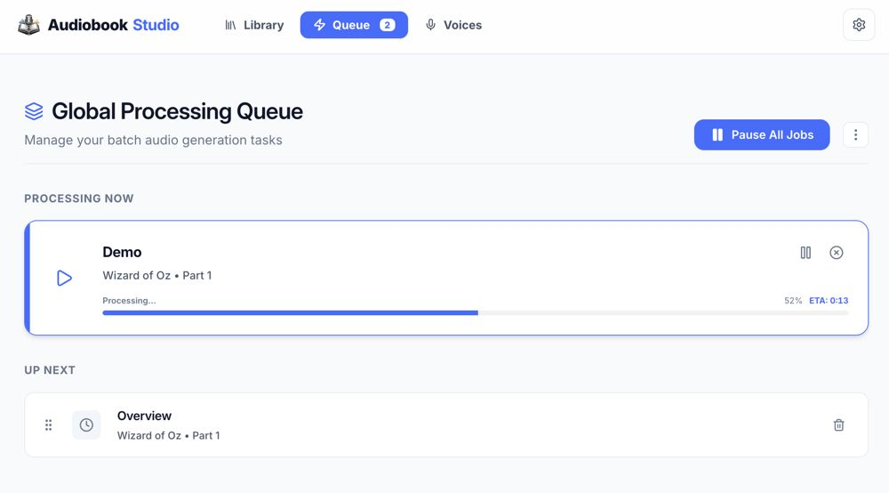

# Queue and Jobs

Audiobook Studio processes audio in the background so you can keep working.

## 🚦 Monitoring the Queue

The **Global Queue** is usually visible on the right sidebar or via a dedicated icon.

- **Queued**: Tasks waiting for their turn.
- **Running**: The current task being processed by the AI engine. You will see a predictive progress bar here.
- **Done/Failed**: History of recent work.
- **Chunk Labels**: Segment jobs now use displayed Performance/Production chunk numbers, so the queue can show titles like `overview: segment #7`.

## ↕️ Reordering Tasks

You can drag and drop items in the **Up Next** section to re-prioritize your work. The system will immediately synchronize the background worker to follow your new order as soon as the current job finishes.

## 📊 Performance Metrics

The system tracks **Characters Per Second (CPS)** and uses it to provide:

- **ETA**: Estimated time remaining for the current job. Now includes a **total queue estimate** at the top of the Global Queue page, summing up all pending and active work in minutes.
- **Predicted Length**: How long the final audio chapter will likely be based on character count.
- **Render Metadata**: Voice builds and synthesis rows can show elapsed render time, duration, character count, and segment count when the engine reports enough timing data.

### Predictive Progress Behavior

- Queue and project-level chapter bars treat backend progress as an authoritative floor, not a visual snap target.
- Between websocket updates, the bar keeps moving locally using the current ETA model so long chapter renders do not look frozen.
- When a new checkpoint arrives, the ETA model changes future pacing and eases toward the new estimate instead of directly teleporting the bar to a new width.
- Grouped chapter renders use weighted render-group progress, so a short final group contributes less than a much larger earlier group.
- Progress starts at synthesis start, not model load or queue preparation. The `START_SYNTHESIS` event should line up with the engine beginning audio generation.
- When a job completes, the visible bar is allowed to finish its final move to 100% before the row leaves the active queue.

### New Features & Fixes
- **Global Queue ETA**: Added an "Approx. X minutes remaining" badge to the processing queue header that tracks cumulative work across all active and queued tasks.
- **Reliable Queue Reordering**: Fixed a timestamp inversion bug and implemented in-memory synchronization, ensuring the background worker strictly follows the UI priority.
- **Enhanced Progress Visuals**: Progress bars now blend predictive updates and backend checkpoints without hard-snapping, while keeping active width transitions enabled so larger corrections still feel continuous.
- **Locked-in Test Suite**: Added 11 regression tests covering ETA calculations, database joins, and in-memory queue synchronization logic.

## 🛠️ Job Types

- **XTTS Generation**: Creating audio for a segment.
- **Voxtral Generation**: Creating preview or render audio through the optional Mistral-backed Voxtral path.
- **Mixed Generation**: Rendering displayed chunk groups that may contain XTTS or Voxtral sections depending on the assigned voice profiles.
- **Baking**: Stitching segments into a chapter file.
- **Assembly**: Creating the final `.m4b` file.

## Chunk-Aware Rendering

- Performance and Production views now work from displayed chunk groups instead of fragile sentence-by-sentence queue items.
- A chapter can mix XTTS and Voxtral as long as the assigned voices resolve cleanly.
- Queue refresh also repairs certain stuck or orphaned queue states automatically, so a restart is needed less often than before.

## Live Event Stream Contract

Studio 2.0 uses named websocket topics so plugins, orchestration, and the frontend agree on who owns each piece of live state.

For queue-visible work, the important topics are:

- `queue.items`: authoritative queue-row creation, status updates, refresh invalidation, and pause state.
- `jobs.lifecycle`: job-level lifecycle such as `queued`, `preparing`, `running`, `done`, `failed`, and `cancelled`.
- `chapters.progress`: chapter-level render progress only.
- `segments.progress`: segment-level progress only.
- `voice.test`: voice preview/test progress only.
- `tts.logs`: diagnostics and live engine log output only.

The queue lifecycle for any queue-visible render path is:

1. Create or refresh the queue row as `queued` on `queue.items`.
2. Emit `JOB_PREPARING` on `jobs.lifecycle`.
3. Emit `START_SYNTHESIS` on `jobs.lifecycle` when synthesis actually begins.
4. Emit runtime progress on the correct scoped topic.
5. Emit a terminal state on `jobs.lifecycle`.
6. Emit a terminal `queue_item_status` on `queue.items`.
7. Emit `queue_item_invalidated` only when a snapshot refresh is needed.

Voice preview/test jobs follow the same queue visibility rules, but their scoped progress belongs on `voice.test`, not `chapters.progress`. They still need a `jobId` so the frontend can connect the voice-test frame to the visible queue row.

Diagnostics are deliberately separate. A plugin may send model-load lines, setup logs, progress text, and synthesis messages to `tts.logs`, but the queue must not infer row state from those logs.

## ⏸️ Pausing and Controls

- **Global Pause**: You can pause the entire queue if you need to free up system resources.
- **Cancel**: Stop a specific job. If it's the 'Running' job, it may take a few seconds to terminate the subprocess.

---

[[Home]] | [[Troubleshooting and FAQ]] | [[File Formats and Audio Guidance]]
