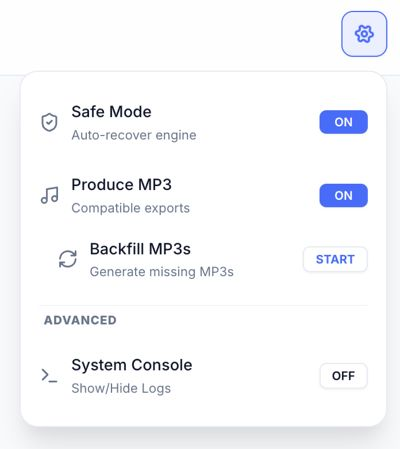

# Settings

Global configuration for Audiobook Studio.

## ⚙️ Application Settings

Access settings via the Sidebar menu.

- **Safe Mode**: Automatically attempts to recover the AI engine if it encounters an error.
- **Produce MP3**: Toggles generation of MP3 files alongside WAV for better compatibility.
- **Backfill MP3s**: Scans your library and generates missing MP3 files for existing chapters.

## 📁 Storage Locations

By default, the application stores data in the following folders:

- `/projects/`: Primary project storage, including project text, audio, and assembled outputs.
- `/voices/`: Voice profiles, samples, previews, and profile metadata.
- `/xtts_audio/`: Legacy/global XTTS output kept for compatibility with older flows and migration paths.
- `/audiobooks/`: Legacy/global assembled `.m4b` output kept for compatibility with older flows.

---

[[Home]] | [[File Formats and Audio Guidance]]
