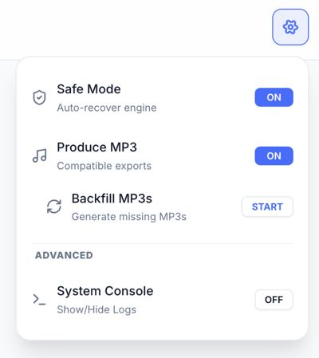

# Settings

Global configuration for Audiobook Studio.

## ⚙️ Application Settings

Access settings via the Sidebar menu.

- **Safe Mode**: Automatically attempts to recover the AI engine if it encounters an error.
- **WAV-first Rendering**: Studio renders chapter audio as WAV. MP3 output is no longer generated as a background render setting; use explicit export/download actions when you need an MP3.
- **Voxtral Enabled**: Shows or hides `Voxtral (Cloud)` voice options without deleting your saved API key.
- **Mistral API Key**: Your personal key for Voxtral preview and render jobs.
- **Voxtral Model**: Optional override for the Mistral TTS model name if you need to change it.

## XTTS And Voxtral

- `XTTS (Local)` remains the default private path.
- `Voxtral (Cloud)` is optional and stays hidden until you save a Mistral API key and enable it.
- Turning Voxtral off hides the UI again, but your saved key can remain in Settings for later.

## TTS Engines

The **TTS Engines** settings area is now the control center for Studio 2.0 plugins.

- **Schema-driven Settings**: Engine forms are generated from each plugin's `settings_schema.json`, so plugin authors can expose settings without hardcoding new Studio UI fields.
- **Voice Generation Speed**: Expanded engine cards show calibrated voice generation speed based on your computer, including characters per second, sample count, and confidence when enough render history exists.
- **Calibration Warming**: Low-confidence calibration displays helper text encouraging more text-to-speech renders to improve speed estimates. This is informational only; it does not trigger automatic renders.
- **Reset Calibration**: Engine cards can clear stored speed calibration when you want Studio to relearn performance after hardware, model, or settings changes.
- **Plugin Import**: Use **Import Plugin (.zip)** to add a plugin package whose `manifest.json` is at the zip root.
- **Plugin Refresh**: Refresh plugins after manually copying a plugin into the `plugins/` folder or after changing plugin metadata.
- **Install Dependencies**: If a plugin declares `requirements.txt`, Settings can surface missing dependencies and offer an install action.
- **Plugin Removal**: User-installed plugins can be uninstalled from the engine card. Built-in plugins are protected by their manifest and cannot be removed from the UI.

Plugin-specific runtime settings are stored under Studio-managed plugin data, not inside the plugin source folder.

### Plugin Trust

**Plugins run unsandboxed** with the same permissions as Studio — full file system and network access. Installing a plugin means executing third-party Python code.

When you import a plugin zip or click **Install Deps**, Studio shows a confirmation dialog listing the engine name, version, and every dependency line before anything is installed. Dependency lines that reference a remote URL (`git+`, `http://`, `https://`) are marked **REMOTE** because they pull and execute code from the internet at install time.

Only install plugins from sources you trust. Plugin signing and a verified-publisher registry are planned for a future Studio release.

## Privacy Note

If you enable `Voxtral (Cloud)`, the text being synthesized and any selected reference audio for that request are sent to Mistral. If you want a fully local workflow, keep your voices on `XTTS (Local)`.

## 📁 Storage Locations

By default, the application stores data in the following folders:

- `/projects/`: Current primary storage for project text, audio, and assembled books.
- `/voices/`: Current voice models and profile metadata.
- `/chapters/`: Default loose chapter-text folder for fresh installs when you use legacy text-file flows.
- `/xtts_audio/`: Historical/global audio output root. Preserved only as a migration-only legacy import source for older workspaces.
- `/audiobooks/`: Historical/global assembled `.m4b` output root. Preserved only for legacy import compatibility.

---

[[Home]] | [[File Formats and Audio Guidance]]
