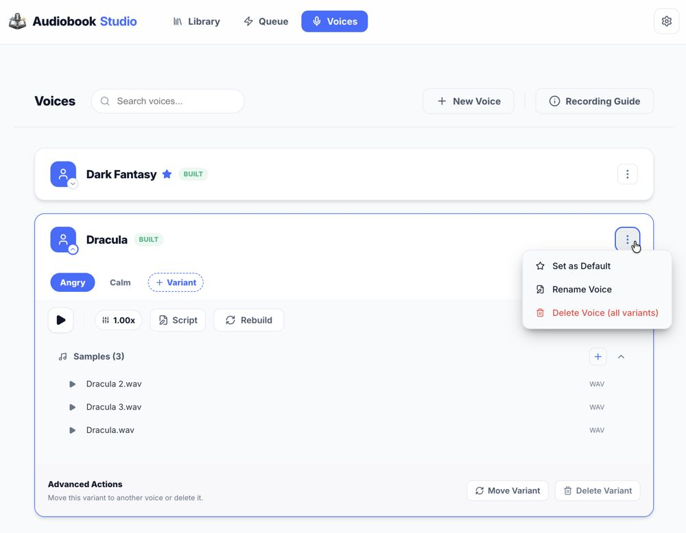

# Voices and Voice Profiles

The **AI Voice Lab** is the standard for managing your narrator library. It uses a unified **Voice** and **Variant** model to keep your workspace organized and efficient.

## 🎙️ Core Concepts

- **Voice**: A high-level narrator identity (e.g., "Narrator", "Dracula").
- **Variants**: Stylistic or emotional variations of that same voice (e.g., "Normal", "Angry", "Whisper").
- **Samples**: The reference audio files used to "clone" the voice.

Each **Voice** always has at least one variant (usually the "Default" variant). You can add as many variants as you need to capture different performances.

## 🚀 Creating and Managing Voices

1. **New Voice**: Click **+ New Voice** at the top. Give it a name like "Victor the Vampire".
2. **Accordion Voice List**: The list uses an **Accordion** layout. Opening one voice card automatically collapses others to keep your view clean.
3. **Unified Model**: Narrators follow a clear **Voice** (identity) and **Variant** (style) hierarchy. Each Voice always has at least one variant.
4. **Add Samples**: Drop 3–5 high-quality `.wav` files into the **Samples** section.
   - _Note_: For new variants with no samples, this section auto-expands so you can get to work immediately.
5. **Build**: Click **Build Voice**. Once built, the Samples section auto-collapses to provide a cleaner view of the performance controls.
6. **Add Variants**: Use the **+ Variant** button inside the expanded voice card to create a new stylistic companion for that voice.

## 🗣️ UI & Navigation

- **Mini Expansion Chevron**: Located in the bottom-right of the Voice avatar. It rotates to show expansion state.
- **Update Indicator**: A tiny rotating arrow in the top-left of the avatar indicates if a variant needs samples or a rebuild.
- **Variant Count Badge**: Displayed in the card header for voices with multiple stylistic variations.
- **Variant Tabs**: Switch between different styles easily. Selecting a tab in a collapsed card will intelligently auto-expand it.
- **Streaming Build Status**: A "BUILDING..." status label persists through sample generation for real-time feedback.
- **Kebab Menu**: Access the **Delete Voice** action from the top-right of the card. This will remove the speaker and cascade deletion to all variant folders and samples on disk.

## ⚙️ Performance Tuning

- **Playback Speed**: Adjust the default speaking rate (0.5x to 2.0x) using the pill-style popover.
- **Edit Script**: Customize the preview text. Testing a voice generates a private preview clip for that specific variant.
- **Build Progress**: Real-time progress indicators and a **"BUILDING..."** status label show you exactly where the voice is in the cloning process, persisting until the new sample is ready.
- **Contextual Management**: In the samples list, the **Delete (X)** button is hidden by default and only appears when hovering over a specific row to keep the interface clean while managing audio.
- **Portable Latent Cache**: Each voice profile now keeps its own `latent.pth` alongside `profile.json` and `sample.wav`, which makes renaming, moving, and sharing a voice bundle much safer.
- **Sample Styling Tip**: The first sample tends to anchor the voice most strongly, while later samples add nuance. Mixing clean examples with different delivery styles can help shape a more interesting profile.

---

[[Home]] | [[Recording Guide]] | [[Concepts]]
