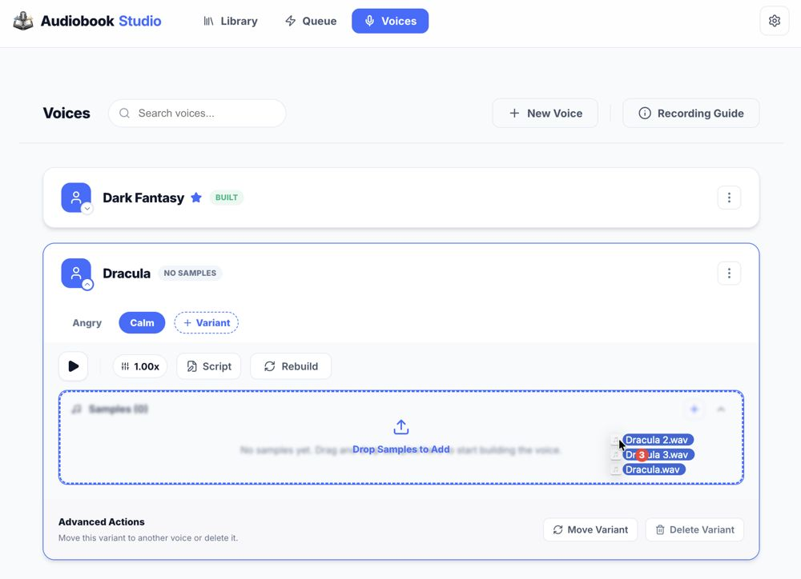
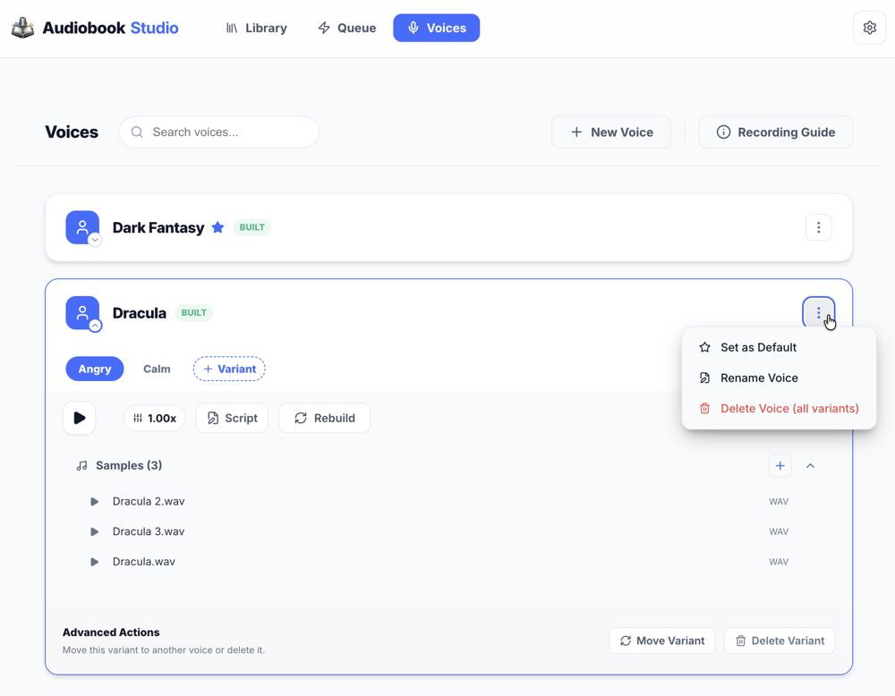

# Voices and Voice Profiles

The **AI Voice Lab** is the standard for managing your narrator library. It uses a unified **Voice** and **Variant** model to keep your workspace organized and efficient.

## 🎙️ Core Concepts

- **Voice**: A high-level narrator identity (e.g., "Narrator", "Dracula").
- **Variants**: Stylistic or emotional variations of that same voice (e.g., "Normal", "Angry", "Whisper").
- **Samples**: The reference audio files used to "clone" the voice.
- **Engine**: Each profile now stores its own synthesis engine, usually `XTTS (Local)` or `Voxtral (Cloud)`.

Each **Voice** always has at least one variant (usually the "Default" variant). You can add as many variants as you need to capture different performances.

## 🚀 Creating and Managing Voices

1. **New Voice**: Click **+ New Voice** at the top. Give it a name like "Victor the Vampire".
2. **Accordion Voice List**: The list uses an **Accordion** layout. Opening one voice card automatically collapses others to keep your view clean.
3. **Unified Model**: Narrators follow a clear **Voice** (identity) and **Variant** (style) hierarchy. Each Voice always has at least one variant.
4. **Add Samples**: Drop 3–5 high-quality `.wav` files into the **Samples** section.
   - _Note_: For new variants with no samples, this section auto-expands so you can get to work immediately.
5. **Build / Generate**: XTTS profiles use the familiar build flow. Voxtral profiles use reference audio or a saved `voice_id` and generate previews without creating a local `latent.pth`.
6. **Add Variants**: Use the **+ Variant** button inside the expanded voice card to create a new stylistic companion for that voice.



## 🗣️ UI & Navigation

- **Mini Expansion Chevron**: Located in the bottom-right of the Voice avatar. It rotates to show expansion state.
- **Update Indicator**: A tiny rotating arrow in the top-left of the avatar indicates if a variant needs samples or a rebuild.
- **Variant Count Badge**: Displayed in the card header for voices with multiple stylistic variations.
- **Variant Tabs**: Switch between different styles easily. Selecting a tab in a collapsed card will intelligently auto-expand it.
- **Streaming Build Status**: A "BUILDING..." status label persists through sample generation for real-time feedback.
- **Kebab Menu**: Access the **Delete Voice** action from the top-right of the card. This will remove the speaker and cascade deletion to all variant folders and samples on disk.



## ⚙️ Performance Tuning

- **Playback Speed**: Adjust the default speaking rate (0.5x to 2.0x) using the pill-style popover.
- **Edit Script**: Customize the preview text. Testing a voice generates a private preview clip for that specific variant.
- **Build Progress**: XTTS profiles build local speaker state. Voxtral profiles regenerate preview audio from reference samples or a saved `voice_id`.
- **Contextual Management**: In the samples list, the **Delete (X)** button is hidden by default and only appears when hovering over a specific row to keep the interface clean while managing audio.
- **Portable Latent Cache**: Each voice profile now keeps its own `latent.pth` alongside `profile.json` and `sample.mp3`, which makes renaming, moving, and sharing a voice bundle much safer.
- **Per-Voice Plugin Settings**: Engines can expose selected settings for individual voices. Common overrides such as speed and model can travel with the voice profile, while plugin-specific controls appear only when the plugin declares them.
- **Sample Styling Tip**: The first sample tends to anchor the voice most strongly, while later samples add nuance. Mixing clean examples with different delivery styles can help shape a more interesting profile.

## Engine Per Voice

- XTTS and Voxtral appear together in the same Voices tab.
- The engine is assigned per voice profile, not per project.
- Mixed-engine chapters are supported, so one section can use XTTS while another uses Voxtral if the assigned profiles differ.
- Voxtral is hidden entirely unless the user enables it in Settings.

## Voice Bundles

Voice bundles are the portable package format for moving a voice between Studio installs or preparing a voice for external distribution.

The canonical bundle layout (see `docs/specs/voice-bundle-template/`) is:

```
<voice-id>/
├── voice.json          # required — machine spec validated against voice.schema.json
├── icon.png            # required — 1:1 aspect-ratio cover image
├── samples/
│   ├── preview.mp3     # required — primary preview clip (Studio + Hugging Face widget)
│   └── preview-*.mp3   # optional — extra samples for different emotions or languages
├── assets/             # optional — engine-specific model files, e.g. assets/xtts/
└── README.md           # optional — HF-compatible page (generated from voice.json by the exporter)
```

`voice.json` is validated against `docs/specs/voice.schema.json`. Key top-level fields include `spec`, `spec_version`, `id` (must match the bundle folder name), `name`, `image`, `samples`, `languages`, `attributes`, `engines`, and `provenance`.

The bundle format supports both local Studio imports and Hugging Face-compatible distribution. On Hugging Face, the `README.md` YAML front-matter wires the `widget … output.url` to `samples/preview.mp3`, making the sample playable directly on the repo page without live inference.

When sharing a bundle, keep engine compatibility in mind. A voice built for `XTTS (Local)` will include assets under `assets/xtts/`, while a cloud or remote engine may rely on provider-specific IDs or reference samples instead.

---

[[Home]] | [[Recording Guide]] | [[Concepts]]
